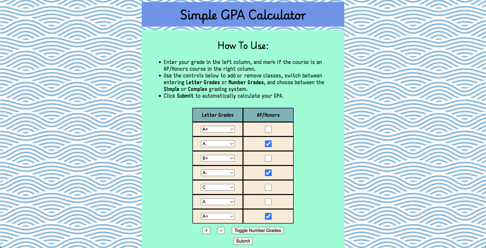
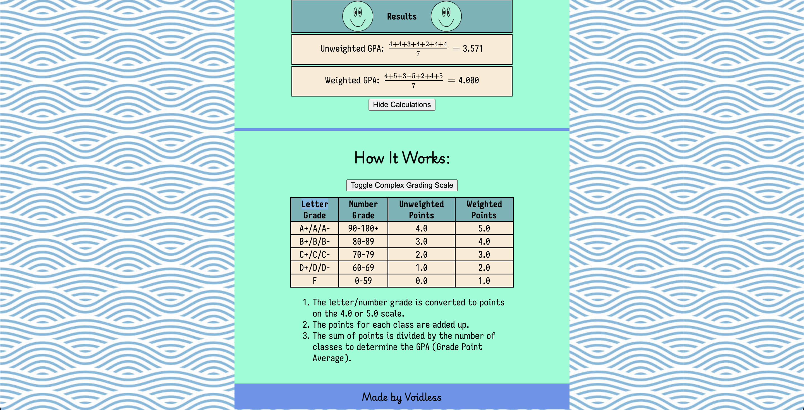

# Voidless's Simple GPA Calculator

A web based GPA Calculator with support for letter grades, number grades, simple and complex grading scales, and weighted courses.

## Features
- Calculate **Unweighted GPA** and **Weighted GPA**
- Enter **Letter Grades** or **Number Grades**
- Use **Simple** or **Complex** Grading Scale
- Add or Remove Courses
- See Calculation used to find GPA

## How to Use
1. Toggle between entering **Letter Grades** or **Number Grades**.
2. Toggle between using a **Simple** or **Complex** Grading scale.
3. Enter a grade for each course.
4. Select **AP/Honors** for each weighted course.
5. Add/remove courses if needed.
6. Click **Submit** to have your GPA calculated.

## How it Works
1. When the grades and weightages are submitted, they are converted into points based on the grading scale.
2. Weighted courses (AP/Honors) get +1.0 grade points.
3. The grade points for all courses are added together.
4. The total sum is divided by the number of courses to get the GPA (Grade Point Average).
- Buttons use HTML onclick events and JS event listeners to detect user input.
- Toggles use booleans to store the current choices.

## Tech Stack
- HTML5
- CSS
- JavaScript
    - MathJax
- GitHub Pages (Hosting)
- ChatGPT (Planning + Organization only)

## Motivation
I built this project because I needed a simple GPA calculator that worked for the system my school uses. Along the way, I learned a lot about HTML, CSS, and JS and learned skills to make cooler projects in the future. 

###### This project was made for Hack Club Horizons.