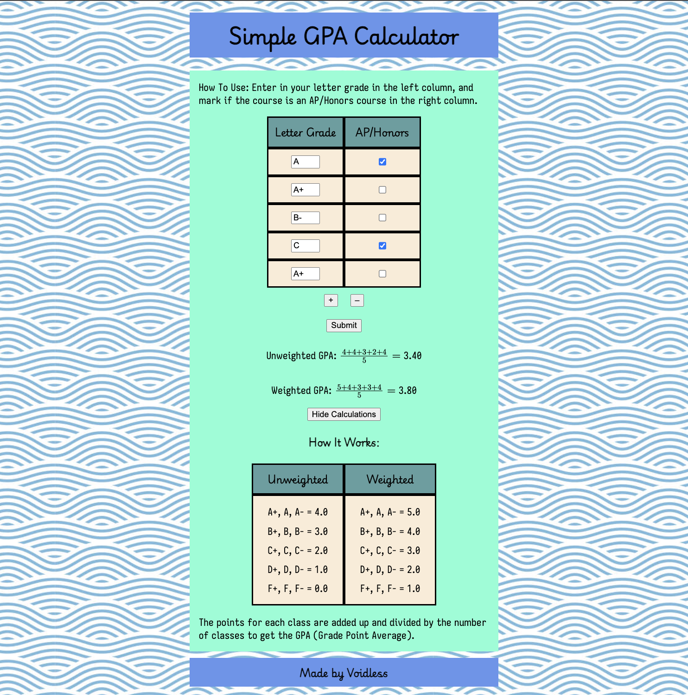
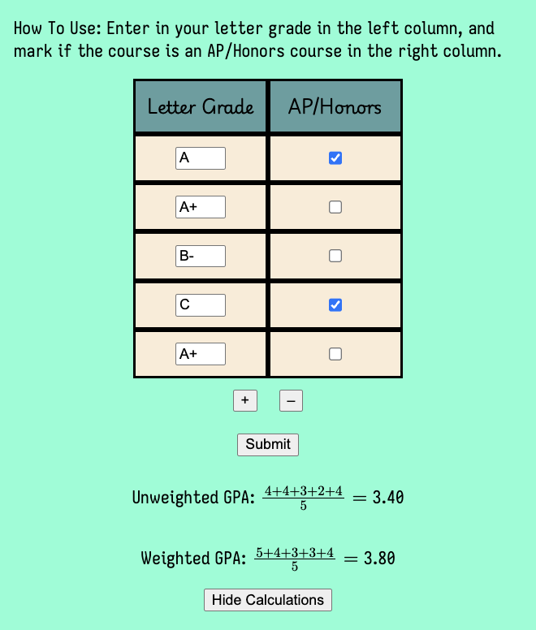

# Voidless's Simple GPA Calculator

This Simple GPA Calculator allows you to calculate your unweighted and weighted GPA with a clean UI and design.

I decided to make this project to put my HTML, CSS, and JS skills to use. I wanted a way to calculate my GPA without figuring out how existing calculators worked, so I made one that works for my needs and my school's grading system.

## How to Use
Enter your letter grades in the left column, and mark if the courses are an AP/Honors course in the right column. 
Use the +/- buttons to add/remove rows for courses. Click submit to get your GPA. 
If you want to see the calculations, click the button.

## Tech Stack
The website uses HTML and CSS for the GUI, and JavaScript to add dynamic elements and calculations.

## How it Works
The rows with the text boxes and check boxes are part of a HTML form element. The values are used to calculate the GPA using loops and basic arithmetic in JavaScript. 
The rows can also be added/removed based on the number of courses to calculate the GPA for. This is done through HTML elements and JS DOM manipulation.
Colors, fonts, and backgrounds are controlled through CSS. 

###### This project was made for Hack Club Horizons.